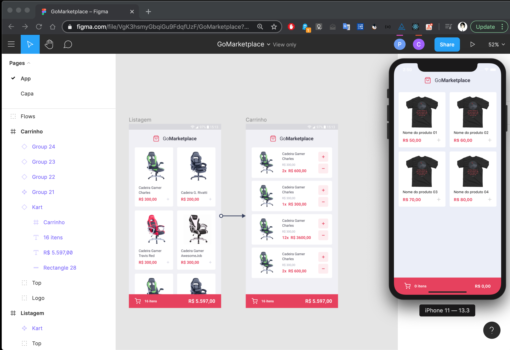

<h1 align="center">🛍 GoMarket Place App</h1>
<h2 align="center">A shopping app for iOS built with ReactNative.</h1>

<br>

<p align="center">
  
</p>


## 💾 Technologies used

This app was build with [React Native](https://reactnative.dev/). 
</br>

## 📃Tutorial and further development

This app was build with [Rocketseat](https://rocketseat.com.br/), as a [challange](https://github.com/Rocketseat/bootcamp-gostack-desafios/tree/master/desafio-fundamentos-react-native) part of the **GoStack Bootcamp** offered by the company. If you want to test it by your own, you can find an awesome [tutorial here](https://www.youtube.com/watch?v=aGtpGPrWXMo) and [other resolution here](https://github.com/MuriloCampos/gostack11-desafio08).
</br>

### How to clone and download the project?

```
# Clone this repository on your computer wished directory
$ git clone https://github.com/discombobulateme/goStack_Desfio8_ReactNative

# Enter directory
$ cd goStack_Desfio8_ReactNative

# Install dependencies
$ yarn

# Install pod
$ cd ios
$ pod install

# Go back to the main folder
$ cd ..

# Start fake API for testing
$ yarn json-server server.json -p 3333

# Start project on iOS simulator
$ yarn ios

```

## This is the main shopping page static view:

<p align="center">
  
</p>

## This is the cart page static view:

<p align="center">
  
</p>
